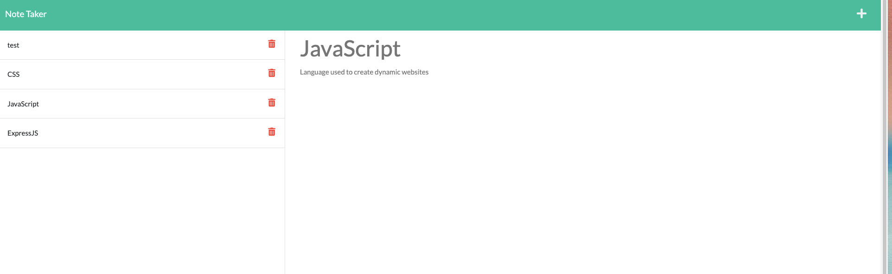

# NoteHub

## Table of Contents
* [Description](#description)
* [Preview](#preview)
* [Installation](#installation)
* [Contributing](#contributing)
* [Questions](#questions)

## Description

This is an application called NoteHub that can be used to write and save notes. NoteHub uses an Express.js back end and will save and retrieve note data from a JSON file. NoteHub is also deployed on Heroku.

## Preview

The following image shows a mock-up of the generated HTML’s appearance and functionality:

## Installation 
The user should clone the repository from GitHub and then install Node. This application also requires a file system and uses Express for routes. 

## Contributing 
Contributors should reference the installation section.  

## Questions
Please contact me at carl.logerie92@gmail.com with any questions.
